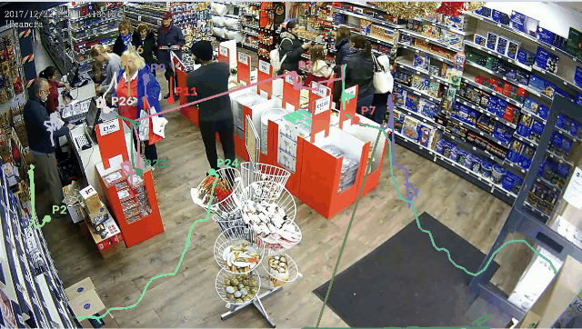
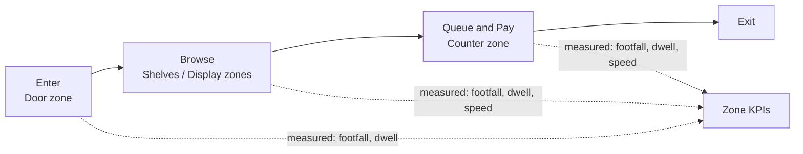
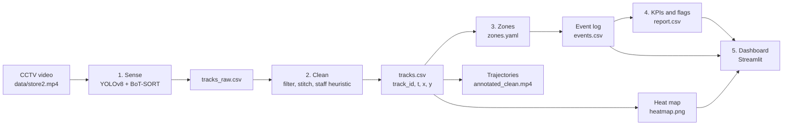
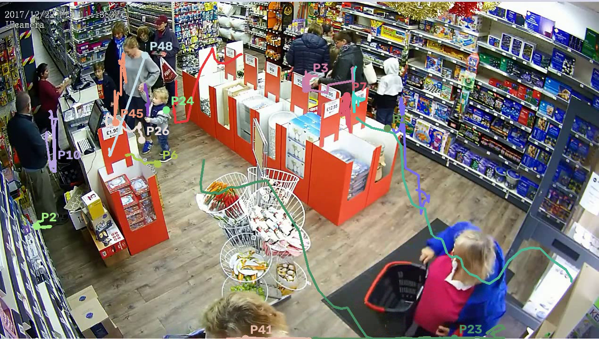
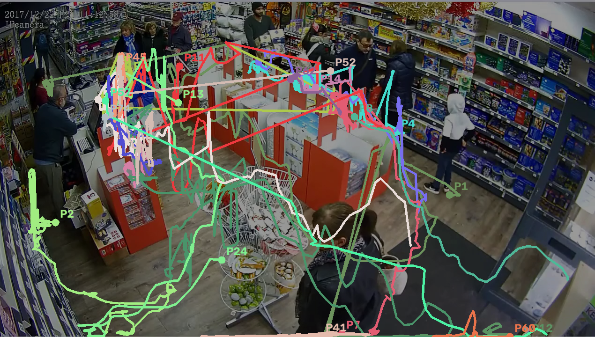
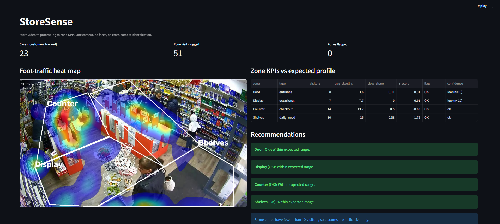
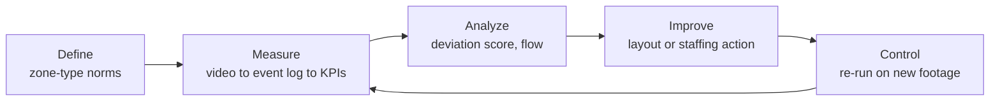

<h1 align="center">StoreSense · Store Flow Analyzer</h1>

<p align="center">
  <b>Existing CCTV, turned into a process-improvement loop for the shop floor.</b><br>
  Heat maps · Trajectories · Event log · Zone dwell times · Bottleneck and dead-zone flags
</p>

<p align="center">
  
  
  
  
  
  
</p>

<p align="center">
  
</p>

> **Team Cipher Cell** · Harimohan Mishra, Bhavyaa Shree · IIIT Naya Raipur · 

---

## 1. The problem

Physical stores place layouts, displays and counters on instinct, because managers cannot see how shoppers actually use the floor.

| Question a store manager has | What is usually missing |
|---|---|
| Where do shoppers browse? | Which sections earn their floor space |
| What blocks the flow? | Displays or narrow aisles that slow traffic |
| Which areas are ignored? | Dead zones that waste prime space |

A plain heat map shows **where people stood**, not **what to change**. StoreSense turns ordinary CCTV video into measurable process data, then compares it with what each kind of zone *should* look like.

## 2. Our idea: the store is a process

> **The store is a process. CCTV is the sensor. The BPM layer is the judge.**



- **Lean lens:** a long queue is *waiting waste*, a display in the main path is *blocked flow*, a detour to essentials is *motion waste*.
- **Zone-type norms:** a staples aisle should be quick, a clothing rack should hold shoppers longer. Each zone is judged against the norm for its **type**, not one universal number.
- **Process first, accuracy second:** aggregate zone metrics tolerate individual tracking errors, so we do not need perfect detection everywhere.

## 3. How it works



| Layer | What it does | Main files |
|---|---|---|
| **Sense** | Detect people, assign IDs inside one camera | `src/track.py`, `configs/botsort_store.yaml` |
| **Clean** | Remove false detections, repair broken tracks | `src/clean.py`, `src/check.py` |
| **Judge** | Map positions to zones, build the event log, compute KPIs and flags | `src/zones.py`, `src/events.py`, `src/metrics.py` |
| **Show** | Heat map, trajectories, dashboard | `src/heatmap.py`, `src/render.py`, `app.py` |

Only plain CSV files pass between layers, so each stage can be tested alone.

---

## 4. Methods in detail

### 4.1 Detection and tracking (Sense)

- **Detector:** YOLOv8 (`yolov8s.pt`), **person class only**, no custom training.
- **Tracker:** BoT-SORT inside the single camera view (configuration in `configs/botsort_store.yaml`).
- **Poor lighting:** contrast enhancement (CLAHE) is applied to the image fed to the detector. The saved video keeps the original frames.
- **Position used:** the bottom-centre of each bounding box (the feet point on the floor).
- **Output:** `output/tracks_raw.csv` with `track_id, t, x, y, x1, y1, x2, y2, conf`.

### 4.2 Cleaning (making noisy video usable)

Real CCTV is messy. People cross paths, bags look like people, racks hide legs.

| Problem we observed | How we handle it |
|---|---|
| ID changes after one person walks in front of another | **Track stitching:** link the end of one track to the start of another when the gap is short and the distance is plausible: $d(\mathrm{end}_A,\mathrm{start}_B)\le d_0 + v_{\max}\,\Delta t$ |
| Backpacks and carried items detected as people | **Carried-item filter:** small boxes mostly inside a larger person box are dropped |
| Static non-person objects | **Static filter:** tiny movement plus low mean confidence |
| Flickering one-frame detections | **Minimum track length** after stitching |
| Staff standing at the counter | **Heuristic:** tracks present for most of the clip and barely moving are separated (see limitations) |
| Weak lighting | CLAHE contrast enhancement before detection |

`src/clean.py` prints what was dropped and why. `src/debug_dropped.py` renders the dropped tracks in red on the video so every decision can be checked by eye.

### 4.3 Trajectories

Each customer's track is a trajectory of `(x, y, t)` points. `src/render.py` draws a fading trail behind every customer, and `src/make_docs.py` draws full paths on a reference frame.

| Tracked customers with trails | All trajectories on the reference frame |
|---|---|
|  |  |

`output/tracks.csv` is the only data the later layers need:

```
track_id,t,x,y
1,0.10,312,540
1,0.20,318,536
2,0.20,702,455
```

### 4.4 Zones

Zones are polygons drawn once per camera, tagged by type. `zones.yaml` for the demo clip is already included.

```
python src/draw_zones.py data/store2.mp4 Door:entrance Display:occasional Counter:checkout Shelves:daily_need
```

A frame slider lets you pick the reference frame, and the track points can be overlaid (key `g`) so polygons cover the real walking paths.

| Zone type | Expected behaviour | What a problem looks like |
|---|---|---|
| `entrance` | Short, fast orientation | Congestion at the door |
| `daily_need` | High traffic, short dwell | Dwell far too long: blocked path, stockout, confusion |
| `occasional` | Lower traffic, long browsing | Dwell far too short: display not engaging |
| `checkout` | A queue forms | Long waits |

Expected dwell mean and standard deviation per type live in `zones.yaml`. They are **starting priors, not measured truths**, and are meant to be calibrated per store.

### 4.5 Event log (video becomes a process log)

Every customer visit to a zone becomes an event, in the same structure used in process mining.

| Column | Meaning |
|---|---|
| `case_id` | One tracked customer (one case) inside one camera |
| `activity` | The zone visited |
| `start`, `end`, `dur` | Visit times and duration in seconds |
| `speed` | Mean walking speed during the visit (pixels per second) |

**How it is built** (`src/events.py`)
1. Smooth the feet points (rolling median).
2. Map each point to a zone (point-in-polygon with Shapely).
3. A new visit starts when the zone changes or after a time gap.
4. Drop very short visits, then merge consecutive same-zone visits separated by a small gap (occlusion, polygon-edge flicker).

Sample from the demo clip (`output/events.csv`):

```
 case_id activity  start   end   dur
       1     Door    0.1   2.1   2.1
       1  Shelves    2.9   4.9   2.0
       1  Shelves   14.7  37.5  22.8
       1     Door   37.6  39.5   1.9
       1  Display   39.6  40.1   0.5
       1  Counter   42.0  46.8   4.8
```

From the log we derive the **flow between zones** (directly-follows counts) and **journey variants**:

```
Directly-follows (zone -> next zone):
Counter  -> Display   6        Display -> Counter   4
Counter  -> Shelves   4        Door    -> Display   2
Counter  -> Counter   3        Door    -> Shelves   2
```

> Journeys are **within one camera**. On the demo clip, more than half of the cases touch only one zone, so we treat journey variants as indicative, not as a finished result.

### 4.6 Heat map

Foot positions are accumulated on a pixel grid and smoothed with a Gaussian kernel:

$$H(x,y) = \big(G_\sigma * N\big)(x,y), \qquad N(x,y)=\sum_i \mathbb{1}\big[(x_i,y_i)=(x,y)\big]$$

The map is normalised and overlaid on the reference frame with zone outlines (`src/heatmap.py`, $\sigma = 35$ px).


### 4.7 Statistics: footfall, dwell, speed and flags

Computed per zone by `src/metrics.py` from the event log.

| Metric | Definition |
|---|---|
| **Visitors (footfall)** | Number of distinct cases that visited the zone |
| **Average dwell** | Mean visit duration in seconds |
| **Slow share** | Share of visits slower than half the median visit speed (a browsing indicator) |
| **Deviation score** | $z = \dfrac{d_{\text{obs}} - \mu_{\text{type}}}{\sigma_{\text{type}}}$ against the zone-type profile |
| **Confidence** | Marked `low (n<10)` when fewer than 10 visitors |

**Flag rules:** `HIGH DWELL` when $z > 2$, `LOW DWELL` when $z < -2$, `DEAD ZONE` when a zone has no visitors, otherwise `OK`.

Sample output on the demo clip:

```
   zone       type  visitors  avg_dwell_s  slow_share  z_score flag confidence
   Door   entrance         8          3.6        0.11     0.31   OK low (n<10)
Display occasional         7          7.7        0.00    -0.91   OK low (n<10)
Counter   checkout        14         13.7        0.50    -0.63   OK         ok
Shelves daily_need        10         15.0        0.38     1.75   OK         ok
```

> The dwell norms are placeholder priors and the sample is one 60-second clip, so these scores demonstrate the **method**, not a verdict on the store.

### 4.8 From signal to action

| Signal | Meaning | Suggested action |
|---|---|---|
| Dwell far above norm, daily-need zone | Bottleneck | Clear the aisle, check stock and signage |
| Dwell far below norm, browsing zone | Low engagement | Improve display, lighting, staff presence |
| No visitors in a zone | Dead zone | Relocate high-margin items, change the path |
| Long time at the counter | Queue bottleneck | Open another counter |

### 4.9 Dashboard

<p align="center"></p>

`streamlit run app.py` shows the heat map, zone KPIs with flags and recommendations, a per-customer timeline, flow between zones, journey variants and the dwell spread per zone.

---

## 5. The BPM view (DMAIC)



| DMAIC step | In StoreSense |
|---|---|
| Define | Zone types and expected behaviour in `zones.yaml` |
| Measure | Tracks, event log, footfall, dwell, speed |
| Analyze | Deviation scores, flow between zones, flags |
| Improve | Plain-language recommendation per zone |
| Control | Re-run on new footage to confirm the change held |

## 6. Problem statement coverage

| Requirement | Status |
|---|---|
| Process standard in-store camera feeds | Done, tested on real CCTV footage |
| Map customer journeys | Within one camera (event log, flow, variants). Cross-camera matching deliberately not attempted |
| Foot-traffic heat maps | Done on recorded footage. Real-time operation is on the roadmap |
| Section-by-section dwell times | Done per zone. Hand validation planned |
| Flag bottlenecks and dead zones | Done with rule-based flags. Norms are priors, not yet calibrated |

---

## 7. Run it

**Install**

```
git clone https://github.com/Harimohan-byte/store-sense.git
cd store-sense
python -m venv venv
source venv/Scripts/activate      # Windows Git Bash
# source venv/bin/activate        # macOS / Linux
# venv\Scripts\Activate.ps1       # Windows PowerShell
pip install -r requirements.txt
```

**Run the demo (`data/store2.mp4`, zones already in `zones.yaml`)**

```
python src/prepare_frame.py data/store2.mp4   # reference frame for the zones
python src/track.py data/store2.mp4           # detect and track      -> output/tracks_raw.csv
python src/clean.py                           # clean and stitch      -> output/tracks.csv
python src/check.py                           # track quality summary
python src/check_zones.py                     # zone coverage         -> output/zones_preview.png
python src/events.py                          # event log             -> output/events.csv
python src/metrics.py                         # KPIs and flags        -> output/report.csv
python src/heatmap.py                         # heat map              -> output/heatmap.png
python src/render.py data/store2.mp4          # trajectory video      -> output/annotated_clean.mp4
streamlit run app.py                          # dashboard at http://localhost:8501
```

Detection is the slow step on a CPU. All generated files go to `output/` (git-ignored).

**Your own footage:** put the video in `data/`, run `python src/draw_zones.py <video> Name:type ...` to draw zones, then repeat the steps above.

## 8. Repository structure

```
store-sense/
├── app.py                    # Streamlit dashboard
├── zones.yaml                # zone polygons, types, expected dwell profiles
├── requirements.txt
├── configs/
│   └── botsort_store.yaml    # tracker settings
├── data/
│   └── store2.mp4            # demo footage (see credits)
├── docs/img/                 # README images
├── output/                   # generated results (git-ignored)
└── src/
    ├── track.py              # video -> raw tracks
    ├── clean.py              # filtering and track stitching
    ├── check.py              # track quality summary
    ├── debug_dropped.py      # shows dropped tracks in red
    ├── draw_zones.py         # interactive zone drawing with frame picker
    ├── prepare_frame.py      # reference frame from zones.yaml
    ├── check_zones.py        # zone coverage report and preview
    ├── zones.py              # zone helpers
    ├── events.py             # tracks -> event log, flow, variants
    ├── metrics.py            # KPIs, z-scores, flags, advice
    ├── heatmap.py            # heat map overlay
    ├── render.py             # trajectory video
    └── make_docs.py          # generates README images
```

## 9. Tunable settings

| Where | Setting | Purpose |
|---|---|---|
| `src/track.py` | model weights, `conf`, `imgsz` | Detection sensitivity and speed |
| `src/clean.py` | `STATIC_CONF`, `STATIC_EXTENT`, `CONTAIN`, `MAX_GAP`, `D0`, `V_MAX`, `MIN_SPAN` | Filters and stitching thresholds |
| `src/events.py` | `GAP`, `MIN_VISIT`, `MERGE_GAP` | How visits are formed and merged |
| `zones.yaml` | `profiles` | Expected dwell mean and standard deviation per zone type |

## 10. Limitations (stated honestly)

- **One camera only.** A person who leaves and re-enters the view gets a new ID. We do not match people across cameras: ceiling views and uneven lighting make re-identification unreliable, errors add up at each handoff, and appearance matching raises privacy concerns.
- **Recorded footage, not real time.** Detection on a CPU is slower than the video. Real-time use needs an edge GPU.
- **Occlusion.** Racks and displays hide feet, and people close to the camera are cropped at the frame edge, so zone assignment is approximate there.
- **Staff vs customers.** The current staff separation is a time-and-movement heuristic. It can mislabel a customer waiting at the counter or miss a staff member who is partly hidden. A staff-zone approach is planned.
- **Journeys are fragmentary on busy clips.** We report them as indicative.
- **Priors are not calibrated.** Dwell norms are starting values, so flags demonstrate the method.
- **Image-space zones.** Zones and speeds are in pixels, not metres.
- **Small sample.** Results come from short clips.

## 11. Roadmap

- Staff zone behind the counter to separate staff from customers.
- Learn each store's own baseline from its footage.
- Queue length and wait estimate at the counter using Little's Law, $W = L/\lambda$.
- Before/after layout comparison to close the DMAIC control loop.
- Floor-plane homography for real distances.
- Cross-camera matching at one or two key points, once single-camera accuracy is validated.
- Edge deployment for real-time heat maps.

## 12. Privacy by design

- No face recognition and no identity. Only anonymous coordinates and timestamps are used downstream.
- No cross-camera appearance matching.
- A deployment would store the anonymous tracks and discard the raw video.

## 13. Credits

- **Demo footage:** `data/store2.mp4` is third-party retail CCTV footage from [ADD: video title, channel and link]. All rights belong to the original owner. It is used here only to demonstrate the method.
- **Built with:** [Ultralytics YOLOv8](https://github.com/ultralytics/ultralytics), BoT-SORT, [OpenCV](https://opencv.org/), [Shapely](https://shapely.readthedocs.io/), [Pandas](https://pandas.pydata.org/), [Plotly](https://plotly.com/python/), [Streamlit](https://streamlit.io/).
- **Team Cipher Cell:** Harimohan Mishra ([@Harimohan-byte](https://github.com/Harimohan-byte)), Bhavyaa Shree · IIIT Naya Raipur.

[ADD: licence, for example MIT, if you want one]
